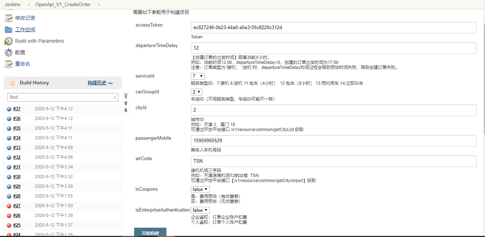
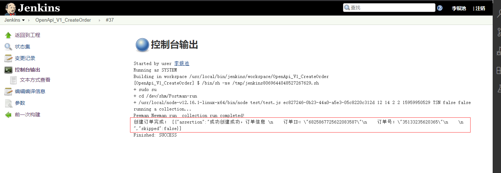

# Postman-run

# 使用

#### nodejs
```bash
node test\test2.js
```

#### nodejs 入参
```bash
node test/test2.js ec827246-0b23-44a0-a5e3-05c8220c312d 12 14 2 2 15959950529 TSN false false
```

配合jenkins job



入参构建结果



产品及其他业务线人员，可以通过这个入口构建专车订单作为测试数据，例如：财务中台组，构建专车订单，在通过订单到财务结算，节省构造数据时间和熟悉非自己业务线的时间。

#### mocha
```bash
mocha
```


# 常见问题：
1.执行node命令行，jenkins job console界面只会体现nodejs脚本中console.log 并不会体现出Postman collection json 前置脚本或后置脚本的console.log。

解决办法：
在Postman collection json 后置脚本中使用断言。
```bash
tests[`创建失败，原因：${json.msg}`] = false;
```

